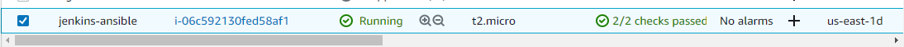

# Documentation of Project11
## Step 1
1. I updated the name tag on my ec2-instance from "Jenkins" to "Jenkins-ansible"

2. I created a new repository in my Git-hub account and named it "ansible-config-mgt"

3. I installed Ansible
  
   `sudo apt update`

   `sudo apt install ansible`

   
   

4. I checked my ansible version

   `ansible --version`

   

5. I created a new freestyle project in my Jenkins server and named it "Ansible"

   

6. I configured webhook in Github

   

7. I tested my setup

   
   
   
   `ls /var/lib/jenkins/jobs/ansible/builds/<build_number>/archive/`
   

## Step 2
1. I cloned down my ansible-config-mgt repository to my jenkins instance
    
    

2. I created a new branch in my cloned repository

   
   
   

3. I created a directory and named it 'playbooks'
   
   

4. I created another directory and named it 'inventory'

   

5. Within the inventory folder, I created an inventory file for each environment.

    

6. I created a playboook in playbooks folder and named it 'common.yml'

7. I imported my key into ssh-agent and confirmed it
   
   eval `ssh-agent -s`

   `ssh-add private key`

   `ssh-add -l`

   

8. I ssh into my server using my ssh agent

    `ssh -A ubuntu@public-ip`

    
     

9. I updated my inventory/dev.yml file with the required code

     

10. I did likewise for playbook/common.yml

## Step 3
1. I commited my code into github

   `git status`
   `git add .`
   `git commit -m "make changes"`
   `git push`

   
   
   

2. I created a pull request and merged it with the main branch
  
  
  

3. I confirmed if the changes has been made

    
    

## Step 4
1. I verified my playbook code and confirmed that it was working.

  `ansible-playbook -i inventory/dev.yml playbooks/common.yml`

  

2. I checked each server to see if wireshark was running

   `wireshark --version`
   
   
   
   
   